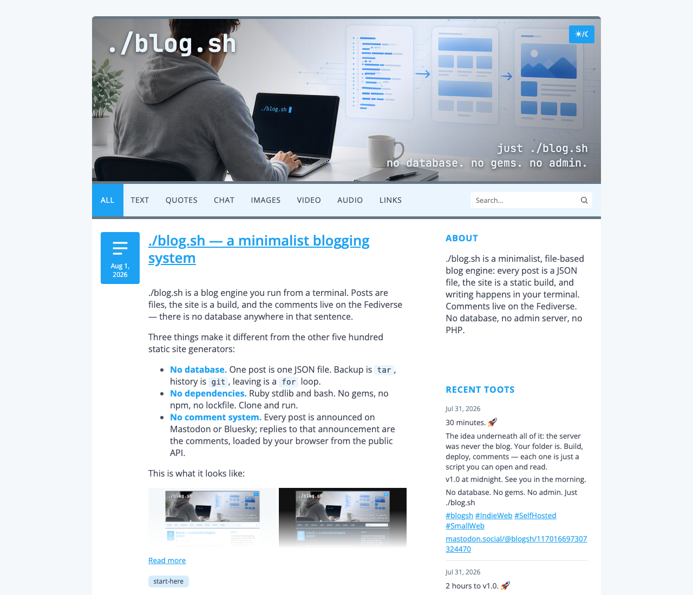
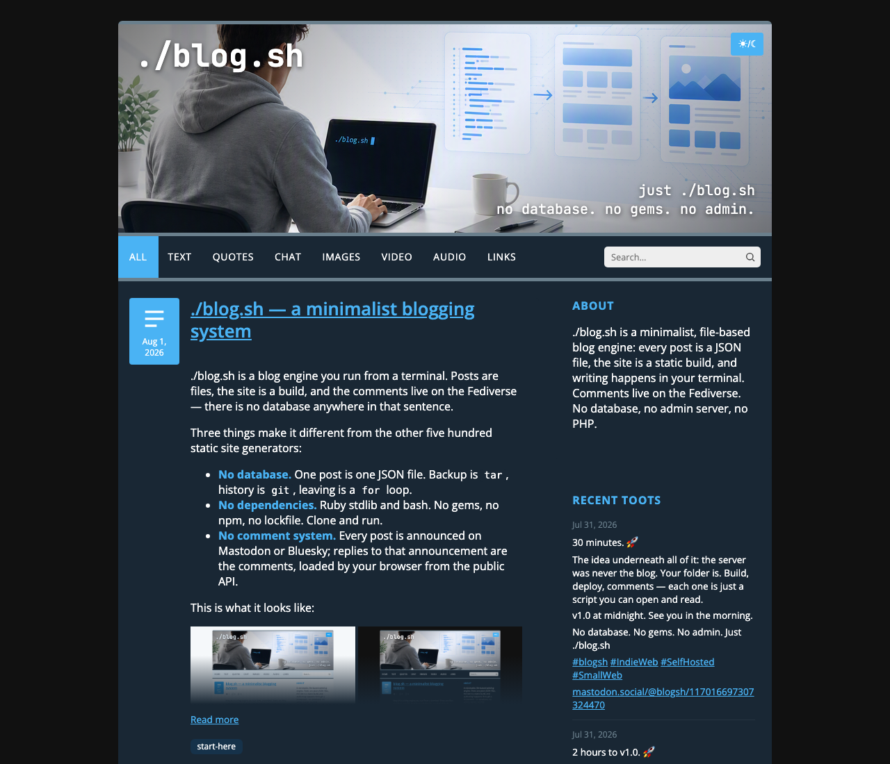

# blog.sh — .sh → .rb → .html

*minimalistic static web/log cms*

[](https://opensource.org/licenses/MIT)
[](https://www.gnu.org/software/bash/)
[](https://www.ruby-lang.org)
[](https://www.json.org)
[](https://developer.mozilla.org/en-US/docs/Web/HTML)
[](https://developer.mozilla.org/en-US/docs/Web/CSS)
[](https://joinmastodon.org)
[](https://bsky.social)

A minimalist, file-based web/log engine. Posts are plain JSON files, the
site is a static build, and authoring happens through a CLI/wizard --
no database, no admin server, no PHP.

MIT licensed (see [LICENSE](LICENSE)).

> **Status:** a personal tool, built for and around a single deployment
> ([sean.cz](https://sean.cz)). It's shared as a working reference and is
> usable as-is if your setup matches the assumptions below (single
> author; deploys to Surfer, rsync, git-pages, rclone or a local
> directory) -- see [Roadmap](#roadmap) for what would need to change to
> fit other setups.

| Light | Dark |
| --- | --- |
|  |  |

*The default blue palette -- both modes come entirely from the 7-key
`colors:` section in `config/site.yml` (see Appearance below).*

## Why this exists

Most static-site generators solve the general case, then make you
configure your way back to something specific. `blog.sh` runs the other
direction: it started from one very specific workflow (write on a phone or
a laptop, publish from a terminal, comments live on Mastodon or
Bluesky, nothing
ever calls out to a third-party JS SDK) and grew a CLI, a build, and a
deploy step around exactly that. A few of the choices that came out of it:

- **Posts are typed content blocks, not a Markdown blob rendered at
  request time.** You write Markdown; on save it's parsed once into a
  structured block format (paragraph, heading, quote, list, table, code,
  image, video, link, divider) -- the same schema the historical
  Tumblr/Twitter imports also normalize into. The build never re-parses
  Markdown, and any future importer just has to target one schema.
- **Comments without a comment system.** Every published post is
  auto-announced on Mastodon *or* Bluesky (the site picks exactly one);
  replies to that announcement *are* the comments. The client fetches
  the thread from the network's public API at render time -- no database
  of comments to moderate or migrate, and the "comment count" next to a
  post is just the reply count on its announcement.
- **Deploys default to paranoid.** `scripts/deploy-web.sh` diffs a SHA-256 +
  size + mtime manifest so it only ships what changed, and refuses to
  proceed if the file count swings too far in either direction versus the
  last deploy -- a bad `--prune` run can't silently empty your site.
- **Nothing renders that wasn't asked for.** Sidebar widgets (toots,
  Pixelfed posts, commits, per-post stats) are fetched server-side on a
  cron, never by the visitor's browser -- so there's no client-side call
  to a third party on every page load, and no widget can slow down or
  break the page for a visitor.

## Feature overview

**Content model**
- One post = one JSON file (`content.nosync/posts/<year>/<slug>.json`), no database
- Content is a list of typed blocks (text, heading, quote, list, table,
  code, image, video, link, divider) -- the same block format used by the
  Tumblr/Twitter migration imports
- Inline formatting (bold/italic/strikethrough/code/link) is stored as
  offsets into plain text, not nested HTML
- Media (`media.nosync/<year>/<slug>/`) always lives locally next to its
  post -- no hotlinking to external hosts
- Post states are `published` / `draft`, with a per-post `draft_token`
  for private preview links

**Authoring -- `blog.sh` (CLI and interactive wizard)**
- `add` -- always starts as a draft; after saving, offers a preview and
  a publish / schedule / keep-as-draft / back-to-editing prompt
- `edit <slug>` -- reopens an existing post as Markdown in `$EDITOR`
- `publish <slug>` -- shows a preview before confirming, never publishes blind
- `schedule <slug>` -- automatic publishing (toot included) by a cron step
  when the post's date arrives; asks for that date, whether reached as the
  [s] dialog choice or as its own command; run again to cancel
- `unpublish <slug>` -- returns a post to draft, deletes its announcement;
  gets a fresh date on the next publish
- `delete <slug>` -- moves to `trash/` (recoverable); `restore <slug>` brings it back
- `toot <slug>` / `bluesky <slug>` -- sends (or resends) the announcement
  after the fact, even for older posts that don't have one yet; never
  overwrites an existing one
- `list [--type=] [--tag=] [--drafts]` -- filtered listing
- `rebuild` -- build and deploy in one step
- Run with no arguments for an interactive menu: arrow keys and single
  keypresses in a terminal (numbers and slugs still work), plain
  line-based prompts when piped or scripted -- and a **QR code of the
  draft's preview URL**, so a post written over SSH opens on your phone
  by pointing the camera at the screen
- `preview [<port>]` -- serves the build locally, no deploy needed
- Writing from a phone: a bare filename in `` resolves against
  `incoming/` (an SFTP staging directory), with a wait loop for the file
  to actually arrive before continuing

**Markdown** (`lib/markdown_parser.rb`, shared by both the build and the authoring tool)
- Paragraphs, headings `#`–`######`, bold/italic/strikethrough/code,
  titled links, bare URLs auto-linked, ordered and nested lists,
  blockquotes, horizontal rules, fenced code blocks with a language hint,
  GFM-style aligned tables, images and video (local file or YouTube) with
  automatic sizing, backslash escaping
- The full syntax reference at `/markdown/` is generated directly from
  this parser, so it can't drift out of sync with what's actually supported;
  its source (`templates/markdown-cheat-sheet.<lang>.md`) is localized the
  same way as `locales/*.yml` -- picked by `site.lang`, English fallback

**Build** (`build_blog.rb`)
- Static HTML from JSON via ERB templates, no framework
- Pagination anchored to the oldest post (page boundaries stay stable as
  new posts are added), plus tag and content-type archives
- RSS, sitemap, `robots.txt`
- `/favicon.ico` generated from `assets/images/favicon.png` by wrapping it
  in an ICO container, for the clients that request the root path blindly
  and never read the `<link>` (bots, feed readers, older browsers)
- Search index split into recent (newest 500, loaded eagerly) and
  archive (the rest, loaded lazily on first search)
- Separate generated pages for `/markdown/` (cheat sheet) and `/search/`,
  outside `content/posts/`
- Dates a reader sees are rendered in `site.timezone`, so an imported post
  stored in UTC shows the day it was actually written; URLs, feeds and the
  sitemap keep the stored offset, since a post's year must never move
- Render memoization -- per-post content/time/type computed once, not
  4-6x across every listing it appears in
- Only changed files are written (`emit`); anything the build didn't
  regenerate this run gets removed afterward (`prune_public`)
- Guards against silent data loss: aborts on a year+slug collision between two posts

**Search**
- Fully client-side, no server round-trip -- `search-index.json` (+ `-archive.json`)
- Quoted phrases, `-word` exclusion, diacritic-insensitive

**Sidebar widgets**
- Latest toots, Bluesky posts, Pixelfed posts, commits, or any RSS/Atom
  feed -- fetched server-side on a cron (`scripts/refresh-sidebar.sh`),
  never by the visitor's browser
- Per-post stats (likes/boosts/replies) for announced posts -- live for
  the last 90 days, refreshed weekly beyond that

**Comments**
- No comment system of its own -- every published post is auto-announced
  on Mastodon or Bluesky (exactly one per site, `mastodon:` or `bluesky:`
  in config), and replies to that announcement are the comments
- The client fetches the thread via the network's public API (Mastodon
  context, Bluesky AppView `getPostThread` -- both unauthenticated);
  like/boost/reply counts surface next to the post in listings too
- On Bluesky the announcement fits the 300-grapheme limit with clickable
  link and hashtags (facets); on Mastodon it uses the instance's limit
  (`mastodon.toot_length`, default 500)

**Security**
- Content-Security-Policy via meta tag, self-hosted fonts (no third-party origins)
- Draft URLs use a `SecureRandom` token plus `noindex`
- Consistent escaping of untrusted data (Fediverse display names, avatars) in both HTML and JS
- `env.sh` (secrets) stays out of git, mode `600`
- No third-party tracking scripts in post data

**Deploy**
- `scripts/deploy-web.sh` → a pluggable backend (`DEPLOY_BACKEND` in
  env.sh): Cloudron Surfer (Files API, the default), a local directory,
  rsync over SSH, a git-pages snapshot push (GitHub/GitLab/Codeberg
  Pages), any rclone remote (S3, R2, WebDAV, ...), or plain SFTP; a
  SHA-256 + size + mtime manifest means only new/changed files are
  uploaded
- `--prune` (optional, the one destructive operation), `--dry-run`, `--only=`
- Safety nets against both a sudden drop and a sudden spike in file count
  versus the previous deploy

**Appearance / UX**
- Light/dark theme via CSS custom properties and `prefers-color-scheme`, with a manual toggle
- Lightbox for images, collapsible mobile navigation, photo galleries
  auto-assembled from adjacent image blocks
- No framework -- vanilla JS in small, single-purpose files
- Color scheme is config-driven, not a file to swap: `assets/css/site.css`
  holds only layout/structure, no color values; `config/site.yml`'s
  `colors.light`/`colors.dark` (7 keys each -- bg/text/meta_text/accent/
  nav_bg/border/pill_bg) are compiled at build time into
  `assets/css/colors.css` (see `build_colors_css` in `build/build_blog.rb`).
  Everything else the CSS needs (card background, nav text/border, link/
  badge hover, search input background) is derived from those 7, not
  separately configurable. Defaults to blog.sh's own blue palette
  (`DEFAULT_COLORS`) if `colors:` is omitted
- Banner overlay: `site.short_name` (top-left, ~30px) and `site.description`
  (bottom-right, ~20px, wraps to multiple lines) render on top of the banner
  image in self-hosted JetBrains Mono. Each overlay darkens the corner it
  sits in so it stays readable against any image -- and only that corner,
  so a banner with both overlays off is shown exactly as authored. See
  `.banner-title`/`.banner-claim` in `site.css`.
  Each independently optional: `banner.show_title`/`show_claim` (default
  true) toggle whether they render at all, `colors.<mode>.banner_title`/
  `banner_claim` override their color per light/dark mode (default: `nav_bg`
  in light, white in dark -- same as before these keys existed), and
  `banner.claim` overrides *only* the overlay's claim with raw HTML (e.g.
  a manual `<br>`) -- `site.description` itself stays plain text
  everywhere else (meta description, RSS), same trust level as `about.html`

**Importing -- `import.sh`**
- Its own wizard, separate from authoring: pick a source, see a dry-run
  preview (posts, media, skipped and why), confirm before anything is written
- Sources: Bluesky and Tumblr via their APIs, Twitter/X from an archive
  export -- the last two carried over from the original migration of four
  Tumblr blogs and a Twitter archive (2008-2022)
- `lib/import/` holds what every source shares -- media download or copy,
  filename numbering, skip accounting, progress callbacks -- so an adapter
  only has to page a source and shape one item
- Each source is also a one-line script (`scripts/migrate_*.rb`) over the
  same adapter, so an import can run from cron as well as from the wizard
- Re-running an import overwrites in place (matched on source id), never
  duplicates

## Stack

- **Build:** Ruby (`build/build_blog.rb`)
- **Authoring:** a Ruby CLI/wizard (`scripts/manage_post.rb`, run via `./blog.sh`)
- **Templates:** ERB (`templates/`)
- **i18n:** `locales/*.yml` + `lib/i18n.rb` -- ships with English (default)
  and Czech; add another `locales/<code>.yml` for a different language,
  missing keys fall back to English
- **Deploy:** pluggable backends (`lib/deploy_backend/`) -- Cloudron
  Surfer (Files API), a local directory, rsync, git-pages, rclone, or
  SFTP; `scripts/deploy_web.rb`
- **Sidebar widgets:** entirely optional, `lib/*_fetcher.rb` + `lib/sidebar.rb`

## Structure

```
blog.sh                  Main tool -- CLI and interactive wizard (see below)
import.sh                Import wizard -- pick a source, preview, confirm (see below)
build/                   Build script (JSON posts -> static HTML)
scripts/                 Ruby CLI, import/deploy scripts, and their .sh wrappers:
                           deploy-web.sh      standalone deploy of public.nosync/ to Surfer (no rebuild)
                           refresh-sidebar.sh cron: refreshes only the sidebar widgets (no site rebuild)
                           migrate_*.rb       one per import source, scriptable alternative to import.sh
lib/                     Shared Ruby libraries (Surfer client, fetchers, post writer, i18n, ...)
lib/import/              Import adapters plus the layer they share (media, run, CLI)
locales/                 UI strings for the generated site and the CLI (en.yml, cs.yml)
templates/               ERB templates (layout, post, index, search, partials)
                         + markdown-cheat-sheet.<lang>.md, the /markdown/ page's source
assets/                  CSS/JS/fonts (drop your own images into assets/images/)
config/site.yml.example  Documented config template -- copy to config/site.yml (gitignored) per deployment
env.sh.example           Documented secrets/env template -- copy to env.sh (gitignored) per deployment
docs/                    Install & operations guides, plus this README's screenshots

content.nosync/, media.nosync/, public.nosync/, incoming/, trash/, drafts/, env.sh, config/site.yml
                         Per-deployment/generated, not part of the engine -- see .gitignore
```

`content.nosync/posts/` (the posts themselves) and `media.nosync/` (their
images/videos) are deliberately **not** part of this repo: they're personal
content, not code, specific to whoever deploys this engine for their own
site. Likewise `config/site.yml` -- only the documented
`config/site.yml.example` template is committed. The `.nosync` suffix also
excludes both directories from iCloud sync on a Mac; on a server, where
iCloud doesn't exist, it's just a name.

## Requirements

- **Ruby 3.0+**, standard library only -- no gems, no Bundler, nothing to
  install. One caveat: the optional Pixelfed/RSS sidebar widgets use
  `rexml`, a Ruby *default gem* (ships with a normal Ruby install, but
  some distro package splits leave it out -- see
  [install.md](docs/install.md#what-you-need) if `gem install rexml`
  is ever needed)
- **bash** (the thin `blog.sh` / `deploy-web.sh` / `refresh-sidebar.sh` wrappers)
- Optional, per integration: somewhere to deploy to (a
  [Cloudron Surfer](https://cloudron.io) app, any rsync/SSH host, a
  GitHub/GitLab/Codeberg Pages branch, an rclone remote, or just a local
  directory served by your own web server), a Mastodon or Bluesky
  account for comments and the auto-announcement, cron for the sidebar
  widgets

## Getting started

1. Copy `config/site.yml.example` to `config/site.yml` and fill in your
   site's title, description, social links, and (optionally) analytics,
   sidebar widgets, and the comments network (Mastodon or Bluesky). Set
   `site.timezone` if you'll publish from a server -- a server clock is
   usually UTC, and without it `schedule` reads times as UTC and a post
   written after midnight can be dated to the previous day.
2. Copy `env.sh.example` to `env.sh` and `chmod 600 env.sh`. An unedited
   copy is enough to try things out locally -- without the Surfer values,
   uploads are simply skipped (logged, not an error).
3. Replace `assets/images/header.png` (the banner) and
   `assets/images/favicon.png` with your own -- both ship with the engine, so
   a fresh clone renders before you've drawn anything. Update `banner.width`/
   `height` to your image's real size; that's what reserves layout space
   before it loads.
4. `./blog.sh add` to write your first post.
5. `ruby build/build_blog.rb` to build, or `./blog.sh rebuild` to build and deploy.
6. `./blog.sh preview` to look at it locally before deploying anywhere
   (serves `public.nosync/` at `http://localhost:8000`, Ctrl-C stops it).

Every integration beyond the core (analytics, each sidebar widget,
comments and the auto-announcement on Mastodon or Bluesky) is optional
and activates only when its
config section is present -- a minimal `site.yml` with just `site`,
`banner`, `about` and `footer` is a complete, working site.

That's the short path. The complete one -- server install, every deploy
backend step by step, the phone workflow, the comments-network setup -- is
[docs/install.md](docs/install.md); day-to-day usage (publishing,
cron, backup, troubleshooting) is
[docs/operations.md](docs/operations.md).

## `blog.sh` -- authoring

```bash
./blog.sh                      # interactive wizard (menu)
./blog.sh add                  # creates a draft, shows a preview, asks what's next
./blog.sh edit [<slug>]        # without a slug, offers the last 50 posts
./blog.sh publish [<slug>]     # shows the draft's preview, asks what's next
./blog.sh schedule [<slug>]    # asks for a date, then auto-publishes the draft when it arrives
./blog.sh unpublish [<slug>]   # moves a published post back to draft (also deletes its announcement)
./blog.sh delete [<slug>]      # deletes a post to trash/
./blog.sh restore [<slug>]     # restores a post from trash
./blog.sh toot [<slug>]        # (re-)sends the comment toot (Mastodon sites)
./blog.sh bluesky [<slug>]     # (re-)sends the announcement (Bluesky sites)
./blog.sh rebuild              # rebuilds and deploys the whole site
./blog.sh preview [<port>]     # serves public.nosync locally (default 8000)
./blog.sh list [--type=image] [--tag=foo] [--drafts]
./blog.sh help
```

## Configuration (`env.sh`, per-deployment, never in git)

Copy [`env.sh.example`](env.sh.example) to `env.sh` (gitignored) and fill it
in -- `chmod 600 env.sh`, since it holds live credentials. It lives wherever
the site is built from: on a server for a deployed site, or just on your
laptop for a local one.

```bash
export SITE_BASE_URL=https://example.com
export MASTODON_ACCESS_TOKEN=...   # comment toots (optional)
export TUMBLR_API_KEY=...          # importing a Tumblr blog (wizard or script)
export DEPLOY_BACKEND=...          # surfer (default) | local | rsync | git | rclone | sftp
export SURFER_URL=...              # surfer backend
export SURFER_TOKEN=...
export SURFER_REMOTE_DIR=...
export DEPLOY_TARGET_DIR=...       # local backend
export RSYNC_TARGET=...            # rsync backend (+ optional RSYNC_SSH)
export GIT_PAGES_REMOTE=...        # git backend (+ optional GIT_PAGES_BRANCH/_CNAME)
export RCLONE_TARGET=...           # rclone backend (+ optional RCLONE_ARGS)
export SFTP_TARGET=...             # sftp backend (+ optional SFTP_REMOTE_DIR/SFTP_ARGS)
```

## Importing existing content

```bash
./import.sh                        # pick a source, preview, confirm
```

Imports land in the same content-block schema as hand-written posts, with
all media downloaded locally -- an imported post is indistinguishable from
one you typed. The wizard **always previews in dry-run first** and asks
before writing: it reports how many posts and media files would be
created, the first few slugs, and why anything was skipped. Re-running an
import is safe -- posts are matched on their source id and overwritten in
place rather than duplicated.

Available sources:

| Source | Needs | Scope |
| --- | --- | --- |
| Bluesky | nothing (public API) | your own standalone posts; replies, reposts and quote-posts are skipped |
| Tumblr | `TUMBLR_API_KEY` | every post on a blog, drafts included, reblog content appended |
| Twitter/X | an extracted archive export | standalone tweets only; replies, RTs and quote-tweets are skipped |
| Mastodon | an unpacked account archive | standalone posts; boosts and replies are skipped, media comes from the archive itself |
| Pixelfed | a statuses export | standalone posts; photos are downloaded, trailing hashtag lines dropped (they're already tags) |
| WordPress | a WXR export file | every post; pages, attachments and menu items are skipped |
| RSS/Atom | a feed URL | whatever the feed carries -- usually only its last few dozen items |

Every source is also reachable without the wizard, for a cron job or a
scripted migration -- same mapping, no preview pass, writes immediately:

```bash
ruby scripts/migrate_bluesky.rb <handle>
TUMBLR_API_KEY=... ruby scripts/migrate_tumblr.rb <blog-name>.tumblr.com
ruby scripts/migrate_twitter.rb <path-to-extracted-export>
ruby scripts/migrate_mastodon.rb <path-to-unpacked-archive>
ruby scripts/migrate_pixelfed.rb <path-to-statuses.json>
ruby scripts/migrate_feed.rb <export.xml | feed-url>
```

All of them take `LIMIT=n` to import only the first *n* posts, which is the
way to sample a large archive before committing hours to it -- a later full
run overwrites those posts in place rather than duplicating them.
They report progress as they go: the size of what they're about to read,
how many items were found and filtered, then a `12/847` counter per post,
because downloading every image of an archive runs for hours and a silent
terminal is indistinguishable from a stuck one.

Two limits worth knowing before you start: only a Bluesky self-thread's
opening post is imported (the continuations are replies), and Bluesky
serves video as an HLS playlist rather than a file, so a video post is
imported as its poster frame with the original linked from `source`.

## Deploy

```bash
ruby build/build_blog.rb   # rebuild into public.nosync/
./scripts/deploy-web.sh            # uploads only new/changed files (SHA256 manifest)
./scripts/deploy-web.sh --prune    # also deletes orphaned files on Surfer
```

`./blog.sh rebuild` does both steps at once.

### Cron (sidebar widgets and post stats)

The sidebar widgets and per-post stats are refreshed by
`scripts/refresh-sidebar.sh` -- it fetches the data, rewrites only the
four JSON files and uploads just those, no site rebuild. Run it from cron
wherever the site is built:

```
*/30 * * * * /path/to/blog.sh/scripts/refresh-sidebar.sh
```

Every 30 minutes is plenty -- the data it refreshes (recent toots,
Pixelfed posts, commits, like/boost counts) doesn't move faster than
that. Skip the cron entirely if no widgets are configured.

A second, optional job powers `./blog.sh schedule` -- it publishes
scheduled drafts whose date has arrived (and does nothing otherwise):

```
*/15 * * * * /path/to/blog.sh/scripts/publish-scheduled.sh
```

## Roadmap

Things that currently assume this exact deployment and would need
generalizing for anyone else to adopt this as-is:

- **Imports** -- Bluesky, Tumblr, a Twitter/X archive, WordPress and any
  RSS/Atom feed are covered. WordPress and feeds share one adapter, because
  they are one format: a WXR export *is* RSS 2.0, with `wp:` elements
  layered on for what a feed has no room for. What a new source needs is an
  adapter with three methods -- everything else (media, dedup, dry-run,
  reporting, HTML → blocks) is already shared. Instagram has no usable read
  API; Threads is feasible but deferred (see below).
- **More comments backends** -- Mastodon and Bluesky are in
  (`lib/mastodon_poster.rb` / `lib/bluesky_poster.rb`, one network per
  site). X and Threads were investigated (July 2026) and settled:
  **X is rejected** -- since February 2026 its API bills per use (reads
  $0.005 each, URL-bearing posts $0.20, no public access), so the
  announcement plus continuously re-fetched comment threads would cost
  real money forever on a personal blog. **Threads is feasible but
  deferred:** its free API can publish and read replies to own posts
  (`threads_content_publish` / `threads_read_replies`), but only
  server-side -- a Meta developer app, an OAuth dance for the first
  token, 60-day tokens needing an auto-refresh cron, and comments
  cached by cron into same-origin JSON (~30min latency) instead of the
  live threads Mastodon and Bluesky give the visitor's browser for
  free. The design is sketched; implementation waits for real demand.
  **Scraping Threads is rejected outright**: the web app's internals
  shift constantly (a maintenance treadmill with no Nitter-style
  community project to carry it), Meta blocks datacenter IPs and
  forbids automated collection in its terms -- shipping that in a
  community engine would hand every user something that breaks without
  warning and risks their account. Paid scraping services fail the same
  test three ways at once: per-request cost, data through a third
  party, dependence on someone else's legal cat-and-mouse.
- **More sidebar widgets** -- five ship today (Mastodon toots, Bluesky,
  Pixelfed, GitHub commits, and a generic RSS/Atom feed), each
  independently optional. The rest was investigated (July 2026):
  **X** only works through a self-hosted Nitter instance -- point the
  RSS widget at it; the official API bills per read and official embeds
  are third-party JS, both non-starters here. **Threads** is feasible
  via its free API (`/me/threads`) but carries the same friction as its
  comments backend -- a Meta developer app and 60-day tokens with an
  auto-refresh cron -- so it waits for real demand. **Instagram** has no
  usable read API since the Basic Display API shutdown; no plan.

## Example deployment

This engine was extracted from the codebase powering
[sean.cz](https://sean.cz), Daniel Šnor's personal blog -- a reference for
what a fully-configured deployment (all optional integrations enabled)
looks like in practice.