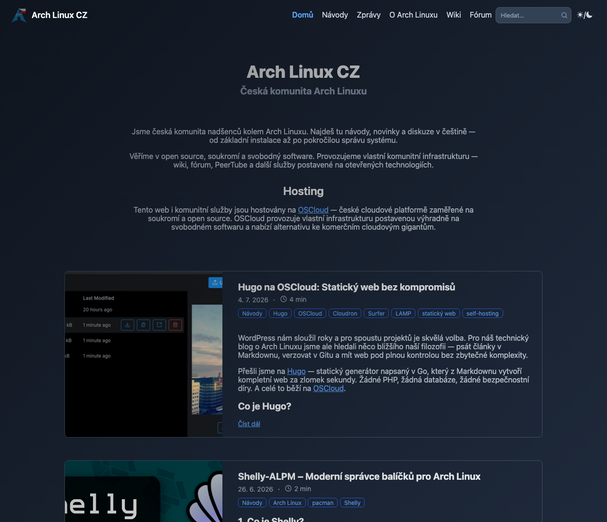
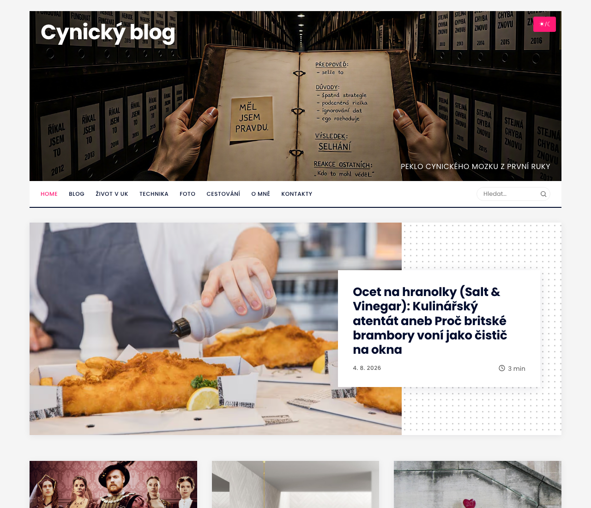

# Skinning blog.sh

Two sites in the wild wear a look the engine never shipped: one dressed as
a Hugo theme, one as Ghost. Neither forked the engine, neither edited a
template, and both survive `git pull` untouched. This guide is what those
two cost to build -- the mechanism first, then the three places where a
skin and the engine can quietly disagree, and last the checks that would
have caught every mistake made along the way.

It is not a CSS tutorial. Everything here is specific to this engine.

## What a skin is, and what it is not

A skin is one stylesheet of yours, loaded after the engine's own, that
repaints what is already on the page.

Before writing one, spend ten minutes with `./style.sh`. A surprising
amount of what looks like skinning is a setting: the colour palette (seven
shipped, or your own), the banner and what is written over it, the menu,
the sidebar and its widgets, whether a post opens with a lead image. A
site that only wants different colours does not want a skin at all -- it
wants a palette, and the palette keeps working when the engine changes.

Reach for a skin when the answer is "the same site, drawn differently":
other typography, other spacing, cards instead of rules, a masthead that
looks like somebody else's masthead. That is what a stylesheet loaded last
can do without owning anything.

## Where the skin lives

`site.extra_css` in `config/site.yml` -- one path, or a list of them,
loaded in order after `colors.css` and `site.css`:

```yaml
site:
  extra_css:
    - "/assets/css/skin.css"
```

Local paths only. Every page carries `style-src 'self'`, so a stylesheet
on another host would be dropped by the browser with no error you would
ever see -- the page would simply render undressed. The build refuses a
remote path out loud instead of letting that happen quietly.

The file is yours, in your working copy, and the engine never writes to
it. That is the whole reason this key exists: an edited `site.css` means a
merge conflict on every update, and the first conflict you resolve badly
is the one that silently drops a rule the engine added.

Note that the engine's `.gitignore` does not exclude stylesheets. Decide
which you want: commit the skin (it is part of your site, and a second
machine will need it), or exclude it locally if the site's repository is
public and the skin is not meant to be. Graphics are already excluded --
`assets/images/*` except the shipped defaults -- so a banner or a portrait
never rides along on an unrelated commit.

## The one rule: your stylesheet loads last

Everything else in this guide follows from it. Loading last means your
rules win at equal specificity -- including the rules the engine wrote for
narrow screens.

That is the trap, and it does not look like one, because on the machine
where the skin is written the phone is not on screen.

A worked example, from a real skin. The engine floats a table of contents
beside the article and, under 700px, stops floating it: the chapters go
back to being a block above the text, because at that width there is no
room beside anything. A skin gave the contents a percentage width to match
its own measure. On the desktop it was too wide and overhung the article.
The fix -- a fixed width and a mirrored gutter -- made the desktop right
and the phone absurd: the article came out 155px wide on a 390px screen,
because the skin's percentage was still winning below 700px, where the
engine had already said `width: auto` and meant it.

### Wrap an override in the range where it applies

```css
@media (min-width: 861px) {
  .toc { width: 350px; }
}
```

Below that, say nothing. The engine has a reflow for small screens and it
is the half of the stylesheet you have least reason to replace: it is
where the layout stops being decoration and starts being whether the text
fits. The cost of this rule is that a skin ends up with more media queries
than it feels like it should need. Pay it.

## Styling one page of a listing

CSS cannot read an address, so for a stylesheet the front page and
`/page/2/` used to be the same document -- which is why the two skins here
both wanted a lead card or a profile block on the first page and neither
could have one.

Since 1.3.2 a listing's `<body>` says which it is:

```css
.page-first .post-list-item:first-child { /* the lead card */ }
.page-cont  .archive-note { /* only on the continuations */ }
```

`page-first` is the page that lives at the listing's own address, `page-cont`
is everything under `/page/N/`, and both are emitted for every listing --
the front page, a tag, a series, a content type. A post page carries a bare
`<body>`, so a rule scoped to either class cannot leak onto one.

Two of them exist rather than one on purpose: a single mark on the
continuations would force you to write the first page's look
unconditionally and then take it back property by property, and a rule that
undoes another is the kind a later change quietly stops undoing. Scope
positively instead.

One card can be more than first by position. With `layout.lead_card` on
in `config/site.yml`, the card that opens the front page is handed its
post's first picture -- placed before its words, whatever the height
budget would have cut -- and marked for you:

```css
.post-list-item--lead .content figure img { width: 100%; }
```

Without the setting no card carries the class, and a rule scoped to it
does nothing; `.page-first .post-list-item:first-child` alone cannot do
this, because the picture is usually not in the card to be styled.

The pair says nothing about *which* listing you are on. That is already in
the markup: the front page's heading carries its own modifier, and a tag
listing names itself.

## What the markup marks for you

A stylesheet can only style what it can select. Each of these was one run
of text, or one element among identical ones, until a skin needed to tell
the parts apart -- so each is marked. Most look exactly as they did
until a rule of yours says otherwise; the page dates and the count are
new words on the page, and `site.css` styles those two.

**The parts of the series sentence.** "Nový Sean.cz — part 3 of 19" is
three spans: `.series-note__name`, `.series-note__sep` and
`.series-note__part`. On the series' own listing every card repeats the
name the heading has just said:

```css
.listing-heading--series ~ .post-list-item .series-note__name,
.listing-heading--series ~ .post-list-item .series-note__sep { display: none; }
```

The joiner is a span of its own so that hiding the name does not leave a
dash opening the line.

**The year of an archive page.** Its heading says a kind and a value, as
a tag's and a series' do: `.listing-heading__kind` is the word "Archive",
`.listing-heading__value` is the year, and the year alone is the link
back to the map of years. Whatever sets the value apart on
`.listing-heading--tag` now works on `.listing-heading--archive` too.

**A listing's own tag.** On `/tag/hills/` every card has "hills" among
its pills. That pill is `.tag-pill.tag-pill-own` there, and an ordinary
`.tag-pill` on every other page:

```css
.tag-pill-own { opacity: 0.5; }
```

**A count of nothing.** The three numbers under a post -- favourites,
boosts, replies -- are `.post-stat`; one that is zero is
`.post-stat.post-stat--zero` as well. The zero is still written, so the
row keeps its three places; whether it is worth reading is yours to say:

```css
.post-stat--zero { visibility: hidden; }
```

The numbers are filled in by a script after the page loads, so this is a
class you will not find by reading the built HTML.

**A mention and a hashtag in a post's text.** A link whose whole text is
"@somebody" or "#something" is `a.mention`, a hashtag `a.mention.hashtag`
as well -- the classes Mastodon's own markup gives them, which is what
the comments under a post and the toots in the sidebar already carry. One
rule now reaches all three:

```css
a.mention { text-decoration: none; }
```

**The author among the replies.** A reply from the account that announced
the post is `.comment.comment--author`. The script tells it by the
address of the announcement, so it works for a live thread, a moderated
one and a Bluesky one alike.

**An answer to a comment.** A reply that answers another reply, rather
than the post, is `.comment.comment--reply`, and `site.css` sets it in by
the width of a picture (`margin-left`, less below 700px). One step
whatever the depth: the list is in thread order, so an answer already
stands under what it answers. To have the thread flat again, set the
margin to zero.

**The search's count and its matches.** The status over the results is
`<span class="search-count">4</span> <span class="search-unit">results</span>`,
so a skin can keep the number and drop the word. In a result's title and
excerpt the words that were asked for are `<mark>`; `site.css` gives it
the pills' ground instead of the browser's yellow
(`.search-result mark`).

**The days a page covers.** Under a listing, the label between the two
links is `page 12` -- the word in `.pagination-word`, the number in
`.pagination-number` -- followed by `.pagination-sep` (the dot) and
`.pagination-dates`; on the page the numbering starts from,
`.pagination-start` stands where the link to older posts would.
`site.css` hides the dot and puts the dates on a line of their own under
the number; to have them on one line, show the dot and make the dates
inline -- and then look at it on a phone, where two links and a range
across a new year do not fit beside each other.

**How many a listing holds.** The number after a heading's name is
`<sup class="listing-heading__count">` -- on the first page of a tag's or
a type's listing, on every page of a series, on an archive year and on
the map of years. It is not on `/page/N/` of a tag, so do not build a
layout that needs it there.

**The ways on from the 404 page.** Under its sentence the page has a
search field and a row of pills. Both are things you have styled already,
with a class added: the field is the bar's `<form class="search-form">`
and is also `.not-found-search`; the pills are a post's tag pills, in
`<div class="tags not-found-links">`, each `.tag-pill.not-found-link`
and one of `--back`, `--archive`, `--year`, `--tags`. So a skin gets them
dressed without a rule -- and usually wants two anyway, because a 404
that centres its sentence will want these centred with it:

```css
.not-found-search { margin-inline: auto; }
.not-found-links  { text-align: center; }
```

`site.css` gives the field a border (the bar's field has none: it is a
light patch on a coloured strip) and makes the input fill its form with
`main .not-found-search input` -- one step heavier than the bar's rule on
purpose, so the width your skin gave the field in the bar does not shrink
this one. A year's pill carries `hidden` until the page's script shows
it; if you give `.not-found-link` a `display`, keep
`.not-found-link[hidden] { display: none; }` after it.

**A result on the cheat sheet.** On `/markdown/` what a source becomes
stands in `<div class="md-example">`, right under the `<pre>` that shows
the source. Without a rule it is invisible, which is the default look:

```css
.md-example { border-left: 2px solid var(--accent); padding-left: 1rem; }
```

## Structures the engine leans on

Three rules in `site.css` are not decoration -- other things are built on
top of them. A skin may change all three, but it should know what it is
paying.

### The bar at z-index 5, and the switch beneath it at 3

`.wrap > nav` is `position: sticky` with `z-index: 5`; the back-to-top
button sits at 10 and the lightbox at 100, and the theme switch on the
banner sits at 3.

Unstick the bar -- a perfectly reasonable thing for a skin to want -- and
the theme switch can stop working while still looking fine. `.wrap` is a
grid, and on a grid item `z-index` takes effect **without** `position`.
The bar keeps its layer, its transparent padding still covers the corner
where the switch sits, and every click lands on the bar instead. Nothing
errors; the button simply does nothing.

If your skin moves the bar, give the switch a layer above it:

```css
#theme-toggle { z-index: 6; }
```

This exact bug shipped, and it was reported by somebody else. It survived
because the switch had been exercised by setting the theme directly rather
than by clicking it -- see *Checking a skin* below.

### The corner of the banner holds two controls, not one

On a site that publishes more than one language (`site.locales`), the
banner's top right corner is a row, `.banner-tools`, holding the language
switcher and the appearance button side by side. They are the same kind of
thing -- a choice about this visit rather than a place to go -- so they are
styled as one pair: two chips of the same height, the row stretching the
shorter one so no number has to be kept in step.

```
.banner-tools          the row (absolute, top/right)
  a.lang-switch        the chip
    .lang-switch__item   a language; .is-current is the one being read
  #theme-toggle        the appearance button
```

A site with one language has no row: `#theme-toggle` stands in the corner
on its own, absolute, exactly as before 1.9 -- so a skin that places it
with `top`, `right` or a `transform` keeps working untouched.

Inside the row the ROW places the button, and the engine resets its
`top`, `right`, `bottom`, `left` and `transform` there, at a weight a bare
`#theme-toggle { ... }` in a skin does not outrank. Numbers written for
the corner would otherwise move the button off its place beside the chip.
So when a skin that places the button meets a site with languages, place
`.banner-tools` with the same numbers instead -- and leave room for it: the
row is wider than the button alone, and a menu that ran up to the button
will run under the chip.

The chip is ONE link, not a link per language: a click anywhere on it
moves to the next language the site publishes and wraps around at the
end, the way the button beside it cycles light → dark → system. The codes
inside it are spans, so style `.lang-switch__item` for how a language
looks and `a.lang-switch` for how the control behaves.

The row deliberately has **no `z-index`**: with one it would become a
stacking context, and `#theme-toggle { z-index: 6 }` -- which the section
above tells you to write when your skin unsticks the bar -- would stop
lifting the button above it. Both children carry `z-index: 3` themselves
instead. If your skin gives the row a layer, give the children one too.

Recolour the switcher with three custom properties rather than by
restating the selectors; each falls back to what the button beside it
uses, so setting none of them keeps the pair in step:

```css
:root {
  --lang-switch-bg: var(--accent);            /* the chip */
  --lang-switch-text: #ffffff;                /* the language being read */
  --lang-switch-dim: rgba(255, 255, 255, .65); /* the others, and the / */
}
```

The chip is a `<nav>`, so the menu's own rules reach it -- gap, minimum
height, borders. Its rule says all of them again; if you restyle it from
scratch, say them again too, or it will quietly grow into a menu bar.

### The excerpt is a positioning context

`.content.excerpt` is `max-height: 500px; overflow: hidden; position:
relative`, with a gradient in `::after` that fades the cut edge.

The `position: relative` is load-bearing for the engine, and inconvenient
for a skin: an absolutely positioned `figure` inside a listing card anchors
itself to the excerpt, not to the card. If your cards put an image at an
edge, take the context off the excerpt in your own rules and turn the
gradient off with it -- a hard cut with no fade is honest, and a fade that
belongs to a box you no longer use is not.

### `max-width` on a flex item is not a cap on its contents

Putting `max-width` on a flex item that also has `flex-basis: 100%` does
not narrow the content -- it shrinks the item's hypothetical width, which
can let the line fit beside the item before it. In one skin the article
body ended up sitting next to its own meta line for exactly this reason.

Cap the children instead:

```css
.content > * { max-width: 62ch; }
```

### Something sticky is as wide as its column, and letters are not

A `position: sticky` heading with a background covers what scrolls under
it -- across its own width, which is the column's. Type does not stay
inside the column: the hook of a "j", an italic's lean, a hanging quote
all reach a pixel or two past the edge, and those pixels scroll by beside
the bar, uncovered. It reads as a rendering fault and is not one.

Carry the background past the column instead of trimming the text:

```css
.archive-section h2 {
  position: sticky; top: 0;
  background: var(--card-bg);
  margin-inline: -0.5rem; padding-inline: 0.5rem;
}
```

### A link stretched over a row needs the whole row to stand in

Making a row one target usually means stretching its link over it:
`position: absolute; inset: 0` on the link, `position: relative` on the
row. In a row that is laid out as a grid this covers one cell, not the
row. An absolutely positioned child of a grid container that is placed in
a grid area takes that AREA as its containing block, and a link you put in
the title column is placed in one.

Take the placement off the stretched box:

```css
.archive-list li { display: grid; position: relative; }
.archive-list li a::after { content: ""; position: absolute; inset: 0; grid-area: auto; }
```

## Checking a skin

The failures above have one thing in common: each was invisible in the way
the skin was being looked at.

**Click every control at least once, for real.** The theme switch, the
menu button on a phone width, an image that opens the lightbox, the search
field, the back-to-top button, and the share row under a post -- its
Mastodon button opens a question with an input and an error line, and
three of the controls are hidden until a script shows them. Setting state
directly -- flipping a data
attribute to photograph the dark theme -- proves the CSS and proves
nothing about whether the control is reachable.

**Measure at three widths, not one.** A wide desktop, something around the
breakpoint, and a phone. The engine's own reflow happens at 700px, so a
skin that has never been seen between 700px and its own breakpoint has an
untested range.

**Look at both schemes.** A skin that only defines colours for one of them
inherits the other from the palette, which is usually fine and
occasionally a white-on-white surprise.

Three traps in browser tooling, all of which have cost an afternoon here:

- A hidden preview panel reports `innerWidth: 0`, and every width and
  height measured through it is then nonsense -- text wrapping to a
  zero-width column, cards ten thousand pixels tall. Check `innerWidth`
  before believing any layout measurement.
- A screenshot does not wait for images to decode. A page photographed the
  instant it loads can show empty frames that are fine a moment later.
- The preview cache outlives a reload. A different origin
  (`127.0.0.1` instead of `localhost`) gets you one clean look; after
  that, version the stylesheet's address in the built page.
- `:focus` and `:focus-visible` do not match in a headless browser unless
  the page is told it has focus -- a window nobody is looking at has
  none. A focus ring that "does not work" there may be fine, and one that
  was never drawn may pass; turn focus emulation on before judging either,
  and then press Tab for real once.

And one in the engine's own tooling. `./blog.sh rebuild` does not wait for
a run that is already going -- a scheduled publish, a sidebar refresh. It
says so, marks the site as owing a deploy and leaves; the next scheduled
run sends what you changed. So "I rebuilt and the site looks the same" is
sometimes the truth for another minute. Before deciding a rule does not
work, compare the stylesheet the live site serves with the one you wrote:

```bash
curl -s https://YOUR-BLOG/assets/css/skin.css | shasum -a 256
shasum -a 256 assets/css/skin.css
```

## Two skins that exist

| One engine, two skins |  |
| --- | --- |
|  |  |
| Hugo/Blowfish: compact bar, profile block, card list | Ghost: full-width lead card, dotted frame, tiles |

Neither picture has anything of the engine's own layout left on screen,
and neither site edited a template to get there. For comparison, the
engine's own look is in the [main README](../README.md).

Both are complete sites, and both deliberately differ from the thing they
imitate.

The Ghost-styled one is pure configuration plus one stylesheet: no
divergence from the engine at all, so updates are a `git pull` and a
rebuild. The Hugo-styled one goes further into layout -- a centred article
column with no sidebar, its own card geometry -- and still owns nothing
but its stylesheet.

Where they part from the original is worth copying as a habit. Search is a
field in the bar rather than a modal, because the engine's search is a
field and rebuilding it as a modal would mean owning behaviour. The
profile block on the home page is missing, because the engine has no such
region and inventing one means inventing its content too. Fidelity is not
the goal; a site that looks like it belongs to that family is.

## When a skin is the wrong tool

If you find yourself replacing structure rather than appearance -- moving
regions, adding a block the engine does not build, needing markup that
does not exist -- a stylesheet has stopped being the cheap option. At that
point editing the template is more honest, and you should know the price
you have just agreed to: every engine update can conflict there, and
`docs/decisions.md` explains what the templates promise and what they do
not.

The other honest answer is that the engine may simply be missing a
setting. If a skin has to fight a region into hiding, say so -- a switch
for a region is a reasonable thing to ask for, and cheaper for everyone
than the CSS that fights it.
